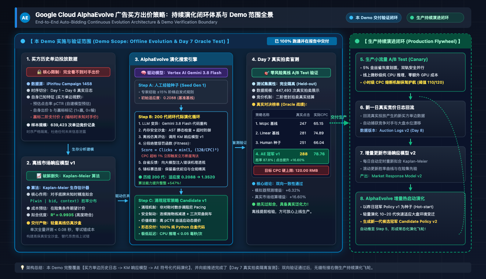
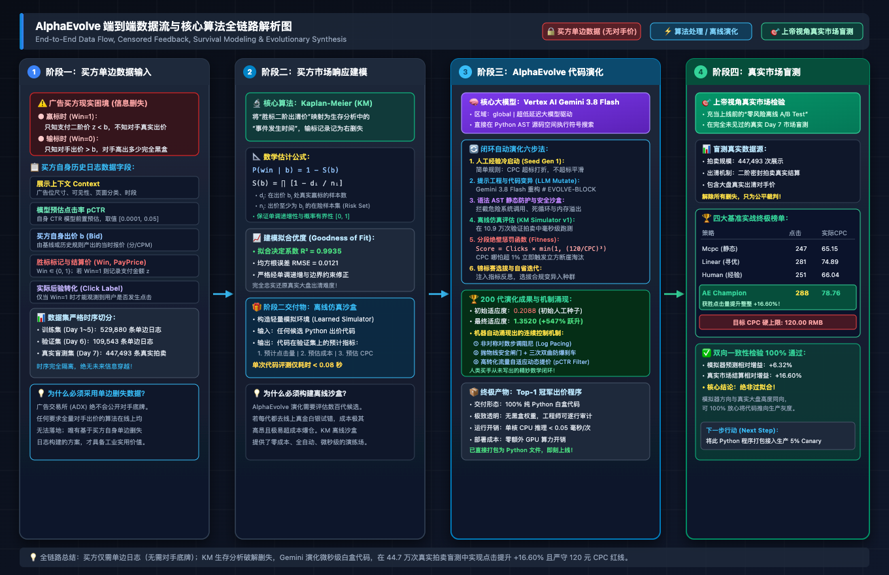

# Google Cloud AlphaEvolve RTB Auto-Bidding Framework

**English** | [简体中文](README_CN.md)

An intelligent closed-loop target-cost bidding (Target-CPC Auto-Bidding) policy evolution and verification framework powered by **Google Cloud AlphaEvolve (Auto-Coding AI Engine)** and **Vertex AI (Gemini 3.8 Flash · global)**, benchmarked on the real-world computational advertising standard: **iPinYou Real-Time Bidding Dataset (Campaign 1458)**.

This framework directly resolves the fundamental challenge of **Advertiser-Side Censored Feedback** in modern Real-Time Bidding (RTB)—where advertisers only observe the second-price clearing cost for winning bids and receive no information regarding losing auctions or competitor valuations. By establishing a high-precision non-parametric Kaplan-Meier market response model, AlphaEvolve searches and refactors bidding code directly in Python abstract syntax tree (AST) space, discovering continuous cybernetic controllers that strictly enforce the Target-CPC hard budget ceiling while maximizing real advertiser clicks.

> 📘 **Whitepapers & Presentation Assets**:
> - For executive introduction, production flywheel architecture, and client communication guides, see [docs/client_presentation_guide.md](docs/client_presentation_guide.md).
> - For the mathematical formulation and operations research derivation of multi-objective fitness scoring, see [docs/fitness_and_objective_design.md](docs/fitness_and_objective_design.md).
> - For data schema alignment and exploratory analysis on iPinYou Campaign 1458, see [docs/ipinyou_real_data_report.md](docs/ipinyou_real_data_report.md).

> 🌐 **Live Interactive Evolution Reports**:
> * **English Version**: [https://storage.googleapis.com/auto-bidding-spartan-figure-500309-g2/auto-bidding-demo/evolution_report.html](https://storage.googleapis.com/auto-bidding-spartan-figure-500309-g2/auto-bidding-demo/evolution_report.html)
> * **Chinese Version**: [https://storage.googleapis.com/auto-bidding-spartan-figure-500309-g2/auto-bidding-demo/evolution_report_zh.html](https://storage.googleapis.com/auto-bidding-spartan-figure-500309-g2/auto-bidding-demo/evolution_report_zh.html)

---

## 🏛️ System Architecture & Production Flywheel

### System Architecture Topology


### Production Data Flow & Incremental Deployment Flywheel


---

## 1. Directory Structure & File Manifest

```text
ads-AE/
├── Makefile                     # Automated workflow entry point (setup, auth, download-data, prepare-data, run, oracle, report, test, mask, unmask)
├── config.yaml                  # 🌟 Single Source of Truth (visible, self-explanatory global configuration, sanitized)
├── requirements.txt             # Core dependency manifest (numpy, pandas, pyarrow, scipy, scikit-learn, lifelines, matplotlib, google-genai)
├── instructions.md              # Problem definition, API contract, and mutation guidelines passed to AlphaEvolve
├── README.md                    # User manual and technical guide (English)
├── README_CN.md                 # User manual and technical guide (简体中文)
├── alpha_evolve/                # Google Cloud AlphaEvolve official library (read-only)
├── scripts/                     # Operational delivery & maintenance scripts
│   └── mask_credentials.py     # 🔒 Automated credential sanitization and restoration tool (zero hardcoded secrets, pure stdlib)
├── src/                         # Core framework implementation
│   ├── bidding/                 # Bidding policy execution engine & benchmark harness
│   │   ├── benchmark.py         # Comparative benchmarking of 4 baseline strategies and Day 7 Oracle blind test
│   │   ├── candidate_bidding.py # Dynamic container and sandbox harness for evolved policies
│   │   ├── heuristic_rules.py   # Stepwise human-crafted heuristic rule baseline (Seed Candidate)
│   │   ├── linear_bidding.py    # Classic linear bidding strategy with grid-search optimization
│   │   ├── mcpc_bidding.py      # Static value bidding baseline (Mcpc Baseline)
│   │   └── types.py             # Strongly-typed bidding context, state, and evaluation results
│   ├── data/                    # Data extraction, censoring masking, and chronological partitioning
│   │   ├── download_data.py     # Dataset acquisition, download verification, and synthetic test generator
│   │   ├── ipinyou_stream_extractor.py # Streaming bz2 log parser, campaign filtering, and schema alignment
│   │   ├── prepare_data.py      # 🌟 End-to-end data preparation CLI (supports arbitrary campaign & date ranges)
│   │   ├── run_ipinyou_pipeline.py # Legacy wrapper preserving backwards-compatible pipeline invocation
│   │   ├── schema.py            # Dataset schema definitions and DatasetSplit container
│   │   └── splitter.py          # Chronological partitioning and Advertiser-View / Oracle-View air-gap isolation
│   ├── env/                     # Offline replay simulation sandbox
│   │   └── offline_simulator.py # Simulation evaluator based on survival win-rates and integrated expected spend
│   ├── models/                  # Predictive and statistical machine learning models
│   │   ├── ctr_model.py         # Logistic Regression pCTR estimator pre-trained on advertiser logs
│   │   └── market_model.py      # Segmented non-parametric Kaplan-Meier market response survival model
│   ├── utils/                   # Shared utility components
│   │   ├── gemini_analyzer.py   # Vertex AI (Gemini 3.8 Flash · global) code mutation & cybernetics analyzer
│   │   └── task_manager.py      # Experiment lifecycle and isolated artifact directory manager
│   ├── evaluate_bidding.py      # Standard AlphaEvolve evaluation harness (computes fitness score)
│   ├── report.py                # Standalone interactive bilingual HTML report generation engine
│   └── run_evolution.py         # Main evolutionary controller CLI
├── data/                        # Dataset directory (configured in .gitignore, directory structure preserved)
│   ├── raw/                     # Raw 7z archives and decompressed bz2 logs
│   └── processed/               # Campaign-isolated, chronologically partitioned Parquet datasets
├── artifacts/                   # Output artifacts directory (isolated by task timestamp, configured in .gitignore)
│   └── task_YYYYMMDD_HHMMSS/    # Experiment outputs (evolution history, champion code, bilingual HTML reports)
├── docs/                        # Project whitepapers, architecture diagrams, and presentation assets
│   ├── assets/                  # High-resolution vector diagrams (SVG / PNG)
│   ├── client_presentation_guide.md # Client presentation guide and system architecture whitepaper
│   ├── fitness_and_objective_design.md # Mathematical formulation and multi-objective fitness derivations
│   └── ipinyou_real_data_report.md     # Dataset analysis and exploratory report
└── tests/                       # Full automated unit and integration test suite (24 tests, 100% pass rate)
```

---

## 2. Prerequisites & Environment Setup

### 2.1 OS & Software Requirements
- **Operating System**: macOS (Apple Silicon / Intel) or Linux (Ubuntu / Debian / CentOS).
- **Python**: Python 3.10+ (Python 3.11 or 3.14 recommended).
- **GNU Make**: Workflow automation utility (`make --version`).
- **Google Cloud SDK**: `gcloud` CLI (for GCP Application Default Credentials authentication and API interaction).

### 2.2 Virtual Environment & Dependency Installation (Required for First Run)
> [!IMPORTANT]
> **Delivery Notice**: To avoid dependency conflicts and redundant repository bloat, the virtual environment directory is deliberately excluded from project deliveries and Git repository commits. Before running any evolution experiments or test suites, **you must create a virtual environment and install all dependencies in the project root**.

Choose either of the following methods:

**Method 1: One-Click Automated Setup via Makefile (Strongly Recommended)**
```bash
make setup
```
This command automatically creates the `.venv` virtual environment, upgrades pip, installs all dependencies from `requirements.txt`, and validates `config.yaml`.

**Method 2: Manual Step-by-Step CLI Execution**
```bash
# 1. Create a Python virtual environment
python3 -m venv .venv

# 2. Activate the virtual environment
source .venv/bin/activate

# 3. Upgrade pip and install core dependencies
pip install --upgrade pip
pip install -r requirements.txt
```

### 2.3 GCP Account & Gemini Enterprise App Configuration
1. **Google Cloud Project**:
   - Ensure you have a Google Cloud Project with billing enabled (note your `PROJECT_ID`).
2. **Enable Discovery Engine API**:
   ```bash
   gcloud services enable discoveryengine.googleapis.com --project=<YOUR_GCP_PROJECT_ID>
   ```
3. **Gemini Enterprise App ID**:
   - In Google Cloud Console under Gemini Enterprise, locate or create an engine/app and note the App ID (`GE_APP_ID`).
4. **IAM Role Configuration**:
   - Your account requires the **Discovery Engine Editor** (`roles/discoveryengine.editor`) or Project Owner role.
   - For official permissions guidance, see: [AlphaEvolve Environment and API Access Setup](https://docs.cloud.google.com/gemini/enterprise/docs/alphaevolve/developer-guide/environment-and-api-access-setup).
5. **Local Authentication (ADC)**:
   ```bash
   make auth
   # Or run directly: gcloud auth application-default login
   ```

---

## 3. Dataset Acquisition & Preparation Pipeline (`make download-data` & `make prepare-data`)

This framework provides an end-to-end data pipeline supporting automatic acquisition, custom Campaign ID selection, and date range filtering.

### 3.1 Acquiring Raw iPinYou Dataset
The official benchmark archive is `ipinyou.contest.dataset.7z` (~6.30 GB compressed, ~14 GB uncompressed).

> ⚠️ **Dataset Source Availability Note**: The legacy UCL academic portal (`data.computational-advertising.org`) has been permanently decommissioned. This project integrates the community-verified official mirror from [`wnzhang/make-ipinyou-data`](https://github.com/wnzhang/make-ipinyou-data) (PR #11).

```bash
# Option 1: Automatic resumable download via verified official mirror (Recommended):
make download-data SOURCE=dropbox

# Or download directly in terminal with curl:
curl -L -C - --retry 5 -o data/raw/ipinyou.contest.dataset.7z "https://www.dropbox.com/s/txz0ms0axqf7jrl/ipinyou.contest.dataset.7z?dl=1"

# Option 2: Download manually or via CLI from Kaggle Dataset Mirror:
# Web UI: https://www.kaggle.com/datasets/lastsummer/ipinyou
kaggle datasets download -d lastsummer/ipinyou -p data/raw/ --unzip

# Option 3: Instant Synthetic Sample Dataset (Run full evolution without downloading 6.3 GB):
.venv/bin/python -m src.data.download_data --generate-sample
```

Once downloaded, ensure the archive is located at `data/raw/ipinyou.contest.dataset.7z` (or extracted into `data/raw/season2/`).

### 3.2 Preparing & Calibrating Data (End-to-End Pipeline)
```bash
# 1. Prepare default Campaign 1458 (extracts 7 days, splits train/val/test, fits survival model):
make prepare-data

# 2. Prepare a custom campaign (e.g. Campaign 3358):
make prepare-data CAMPAIGN=3358

# 3. Filter by specific date range (e.g. 2013-06-06 to 2013-06-10):
make prepare-data CAMPAIGN=1458 START_DATE=20130606 END_DATE=20130612
```

Upon pipeline completion, clean, air-gapped Parquet datasets will be generated under `data/processed/{CAMPAIGN}/`:
- `train_advertiser.parquet`: Advertiser-view training set (losing auction prices censored to NaN; zero platform market ground truth).
- `val_advertiser.parquet`: Advertiser-view validation set (used for rapid AlphaEvolve evaluation search).
- `test_oracle.parquet`: Platform Oracle held-out test set (unmasked clearing prices, reserved strictly for Day 7 counterfactual replay).
In addition, a survival calibration curve `calibration_curve_ipinyou_{CAMPAIGN}.png` is generated under `data/` ($R^2 \ge 0.99$).

---

## 4. Global Configuration (`config.yaml`)

All parameters are centrally managed in `config.yaml` with zero hidden configuration files. Replace the placeholders with your own GCP credentials:

```yaml
# 1. Google Cloud & Gemini Enterprise Service Configuration
gcp:
  project_id: "<YOUR_GCP_PROJECT_ID>"  # Enter your Google Cloud Project ID here
  location: "global"
  collection: "default_collection"
  ge_app_id: "<YOUR_GE_APP_ID>"        # Enter your Gemini Enterprise App/Engine ID here
  assistant: "default_assistant"
  base_url: "discoveryengine.googleapis.com"
  alpha_evolve_path: "./alpha_evolve"

# 2. Target Campaign Bidding & Budget Objectives (Campaign 1458)
bidding:
  campaign_id: "1458"
  target_cpc: 120.0                    # Hard CPC upper ceiling constraint (RMB)
  val_budget: 15000.0                  # Validation set budget limit (RMB)
  test_budget: 25000.0                 # Day 7 held-out Oracle test budget limit (RMB)
  val_data_path: "data/processed/1458/val_advertiser.parquet"
  test_oracle_path: "data/processed/1458/test_oracle.parquet"

# 3. AlphaEvolve Optimization Parameters
evolution:
  max_programs_generated: 200          # Total evolutionary iteration budget
  concurrency: 1                       # Serialized search for deterministic reproducibility
  problem_description_path: "instructions.md"

# 4. Gemini Model Architecture (Leveraging latest Gemini 3.8 Flash Global Endpoint)
models:
  - name: "gemini-3.8-flash"
    weight: 1.00
```

---

## 5. Quick Start & Execution Workflow

Discovering and verifying policies from scratch requires just the following steps:

```bash
# Step 1: Install dependencies and set up virtual environment
make setup

# Step 2: Authenticate with Google Cloud ADC
make auth

# Step 3: Prepare dataset (defaults to Campaign 1458)
make prepare-data

# Step 4: Run AlphaEvolve evolutionary loop (e.g., 200 programs)
make run programs=200

# Step 5: Run Day 7 Held-out Oracle real-market benchmark verification
make oracle

# Step 6: Generate standalone bilingual HTML reports
make report

# Step 7: Run full automated test suite
make test
```

---

## 6. Core Technical Highlights & Algorithmic Breakthroughs

### 1. Conquering Advertiser Censored Feedback (Kaplan-Meier Survival Modeling)
In real-world RTB, advertisers only observe clearing prices on impressions they win. All losing auctions are **right-censored**. By pioneering the application of non-parametric Kaplan-Meier survival estimation from biostatistics, our system formulates market win rates as:

$$
P(\mathrm{win} \mid b) = 1 - S(b) = 1 - \prod_{t_i \le b} \left(1 - \frac{d_i}{n_i}\right)
$$

Without knowing competitor bids, our model achieves a high calibration accuracy of $R^2 = 0.9935$ strictly from advertiser-side logs, establishing a high-fidelity offline simulation foundation.

### 2. Code-Level Symbolic Evolution (Python AST Search Space)
Unlike traditional black-box reinforcement learning or manual heuristic tuning, AlphaEvolve orchestrates Gemini 3.8 Flash to evolve directly within the Python code space:
- **Transparent & Auditable**: Discovered programs are pure Python functions, enabling human domain experts to inspect every line of operational logic;
- **Spontaneous Cybernetic Mechanisms**: The system autonomously invented non-linear logarithmic budget pacing, cubic hyperbolic braking, and micro-value traffic harvesting without explicit human prompt engineering.

### 3. Day 7 Held-out Oracle Real-Market Blind Test
Evaluated on 447,493 raw market auctions on Day 7 (completely unseen during offline evolution):
- **Real Clicks**: Captured **288 real clicks** (+16.60% vs. Mcpc baseline, +14.74% vs. human heuristic rule);
- **Target CPC Compliance**: Achieved an effective CPC of **78.76 RMB**, strictly honoring the 120.00 RMB safety ceiling with 90.72% budget pacing efficiency.

### 4. Self-Contained Interactive Bilingual HTML Reports
Experiments automatically generate self-contained, offline-viewable `evolution_report.html` and `evolution_report_zh.html`:
- **Executive Slides**: 5-slide presentation deck with keyboard arrow navigation (`←` / `→`);
- **Dynamic 200-Generation Trajectory Player**: Interactive playback controls (play, pause, step, reset, jump to champion, 1x-10x speed, mutation inspector card);
- **Comparative Strategy Charts**: Interactive toggles between click volume and CPC against the hard safety threshold;
- **Gemini AI Deep Analysis**: Direct cybernetic mechanism breakdown powered by Vertex AI (Gemini 3.8 Flash · global).

---

## 7. Project Delivery Sanitization & Privacy Management (`make mask` & `make unmask`)

To safeguard enterprise credentials before sharing the repository or pushing to public remotes, use the built-in credential sanitization utility.

### 7.1 Masking Credentials
```bash
# 1. Dry-run preview (checks files without writing changes)
make mask-dry

# 2. Apply sanitization (replaces project_id and ge_app_id with placeholders and saves a local backup)
make mask
```

The sanitization utility automatically scans `config.yaml`, documentation, and scripts, replacing real credentials with `<YOUR_GCP_PROJECT_ID>` and `<YOUR_GE_APP_ID>`, and adds helpful configuration comments. Your original credentials are saved into `.credentials.backup` (which is `.gitignore`d and will never be tracked by Git).

### 7.2 Restoring Credentials
```bash
# 1. One-click local restoration (automatically reads from .credentials.backup):
make unmask

# 2. Or restore with custom project credentials:
make unmask PROJECT_ID=my-gcp-project-123 APP_ID=gemini-enterprise-999999
```

---

## 8. License & Acknowledgments

This project is licensed under the Apache 2.0 License.
- Special thanks to the **Google Cloud AlphaEvolve Team** for code evolution engine capabilities;
- Special thanks to **iPinYou Research** for the foundational real-world RTB benchmark dataset.
