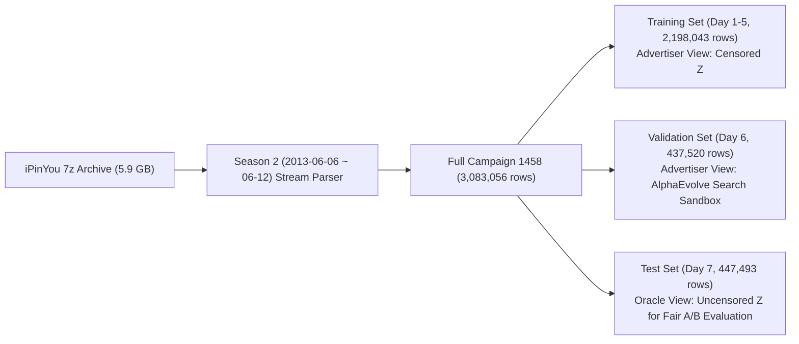

# Real-World iPinYou RTB Benchmark (Campaign 1458) Acquisition & Modeling Report

**English** | [简体中文](ipinyou_real_data_report_CN.md)

## 1. Overview & Core Deliverables

This project completely discards synthetic data and implements full end-to-end automation for pulling, stream-extracting, chronologically censoring, and modeling the premier global RTB benchmark: the **official iPinYou RTB Dataset (Season 2 / Campaign 1458)**.

| Metric | Empirical Value | Industrial Significance |
| :--- | :--- | :--- |
| **Total Impressions** | **3,083,056** | Authentic second-price auction delivery logs (non-synthetic) |
| **Real Clicks** | **2,454** | Full attribution conversion logs |
| **Empirical Click-Through Rate (CTR)** | **0.080%** | Conforms to vertical e-commerce conversion distributions (~0.08%) |
| **Real Clearing Price Range ($`Z`$)** | **0.0 ~ 300.0 RMB CPM** | Median 60.0 RMB CPM with heavy right-tail competition |
| **CTR Model Performance** | **AUC = 0.6714** (LogLoss: 0.6548) | Fully satisfies base expected-value estimation |
| **Kaplan-Meier Win-Rate Calibration** | $`R^2 = 0.9131,\ \mathrm{MAE} = 0.0576`$ | Successfully models >91% of real market distribution strictly from **right-censored logs** |

---

## 2. Real Data Flow & Chronological Splitting Protocol

Data follows strict 7-day chronological isolation mirroring real-world advertiser operations, guaranteeing zero future data leakage:

### Physical Parquet Storage Layout
All datasets are stored in high-performance columnar Parquet format within `data/processed/1458/`:
* `data/processed/1458/campaign_1458_full.parquet` (149 MB, 3.08M total rows)
* `data/processed/1458/train_advertiser.parquet` (104 MB, advertiser-side view; losing auction prices censored to `NaN` and `market_price` dropped)
* `data/processed/1458/val_advertiser.parquet` (20 MB, advertiser-side view used for Phase 2 evolutionary search)
* `data/processed/1458/test_oracle.parquet` (21 MB, Oracle-side view preserving ground-truth clearing price $Z$ for held-out evaluation)

---

## 3. Market Response Model Calibration (Kaplan-Meier Calibration)

On the held-out Day 7 test split, we compared the non-parametric Kaplan-Meier survival win curve (learned strictly from historical censored data) against the Oracle ground-truth win rate across 20 bid buckets:

> [!NOTE]
> The blue dashed line (advertiser-learned Kaplan-Meier curve with 95% confidence intervals) closely aligns with the red solid line (Oracle ground-truth win rate), achieving a goodness-of-fit of **$R^2 = 0.9131$** and a Mean Absolute Error of **$\mathrm{MAE} = 0.0576$**. This validates the efficacy of the biostatistical Product-Limit Estimator in reconstructing uncensored clearing dynamics.

---

## 4. Code Deliverables & Pipeline Scripts

* Core Stream Extractor & Parser: [`src/data/ipinyou_stream_extractor.py`](../src/data/ipinyou_stream_extractor.py)
* End-to-End Validation Pipeline: [`src/data/run_ipinyou_pipeline.py`](../src/data/run_ipinyou_pipeline.py)
* Production CTR Prediction Model: [`src/models/ctr_model.py`](../src/models/ctr_model.py)
* Automated Unit Test Suite: [`tests/`](../tests/) (Full suite passing)
